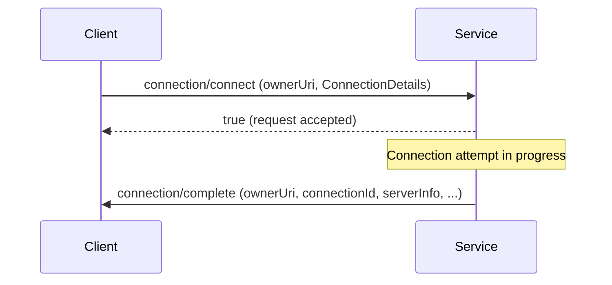

The Connection API lets you open, monitor, and close connections to SQL Server databases. All connection operations are scoped to an `ownerUri`, a string that uniquely identifies the connection within your session.

## The ownerUri concept

Every connection in SQL Tools Service is bound to an owner URI. This is typically the absolute path of a SQL file open in the editor, but it can be any stable string that identifies the logical owner of the connection.

```
file:///c:/Users/alice/project/query.sql
```

You provide this URI when opening a connection and then reuse it in every subsequent request — running queries, listing databases, disconnecting — to tell the service which connection to act on. Multiple connections can coexist; each is addressed independently by its `ownerUri`.

## Available methods

<Note>
  Arrow direction indicates who initiates the message. Requests marked with a left arrow are sent by the client; notifications marked with a right arrow are sent by the service to the client.
</Note>

| Method | Direction | Description |
|--------|-----------|-------------|
| `connection/connect` | Client → Service | Open a new connection |
| `connection/cancelconnect` | Client → Service | Cancel an in-progress connection attempt |
| `connection/disconnect` | Client → Service | Close an existing connection |
| `connection/listdatabases` | Client → Service | List databases on the connected server |
| `connection/changedatabase` | Client → Service | Switch the active database on an existing connection |
| `connection/getconnectionstring` | Client → Service | Build a connection string from connection details |
| `connection/buildconnectioninfo` | Client → Service | Parse a connection string into `ConnectionDetails` |
| `connection/complete` | Service → Client | Notification fired when a connection attempt finishes |
| `connection/connectionchanged` | Service → Client | Notification fired when connection state changes |

## Async connection pattern

`connection/connect` returns a `bool` immediately, indicating only that the request was accepted. The actual connection result arrives later as a `connection/complete` notification pushed from the service to the client.



A successful `connection/complete` payload includes a `connectionId` GUID and `serverInfo`. A failed attempt includes `errorMessage` and `errorNumber` instead.

If the connection is taking too long, send `connection/cancelconnect` with the same `ownerUri` to abort the attempt before `connection/complete` fires.

## Notifications

### connection/complete

Fired once a connection attempt finishes, whether it succeeded or failed.

Key fields in the notification body:

| Field | Type | Description |
|-------|------|-------------|
| `ownerUri` | string | URI that was used in the original `connection/connect` request |
| `connectionId` | string | GUID uniquely identifying the connection (success only) |
| `connectionSummary` | object | Server name, database name, and user name |
| `serverInfo` | object | Server version, edition, and other metadata |
| `errorMessage` | string | Human-readable error description (failure only) |
| `errorNumber` | number | Engine error code (failure only) |
| `messages` | string | Additional diagnostic text |

### connection/connectionchanged

Fired when a connection's active database or other properties change after it has been established.

| Field | Type | Description |
|-------|------|-------------|
| `ownerUri` | string | URI of the connection that changed |
| `connection` | object | Updated `ConnectionSummary` (serverName, databaseName, userName) |

## Pages in this section

<Columns cols={2}>
  <Card title="connect / disconnect" href="/api/connection/connect">
    Open connections, cancel in-progress attempts, and close connections. Includes the `connection/complete` notification reference.
  </Card>
  <Card title="Database & connection info" href="/api/connection/disconnect">
    List databases, switch the active database, retrieve or parse connection strings.
  </Card>
</Columns>
